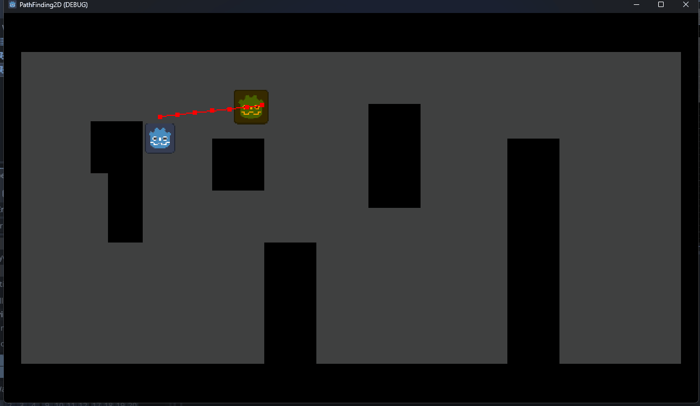
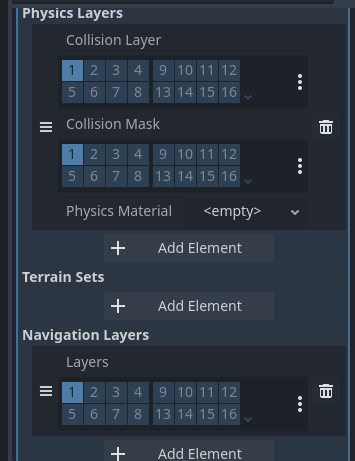
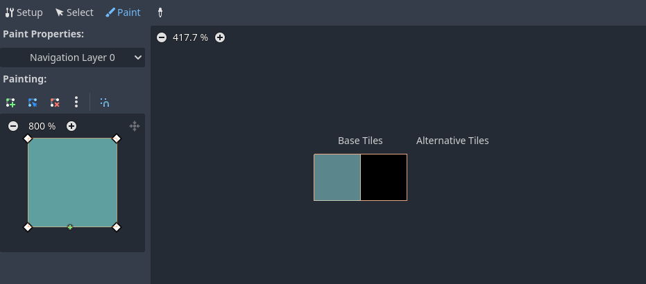
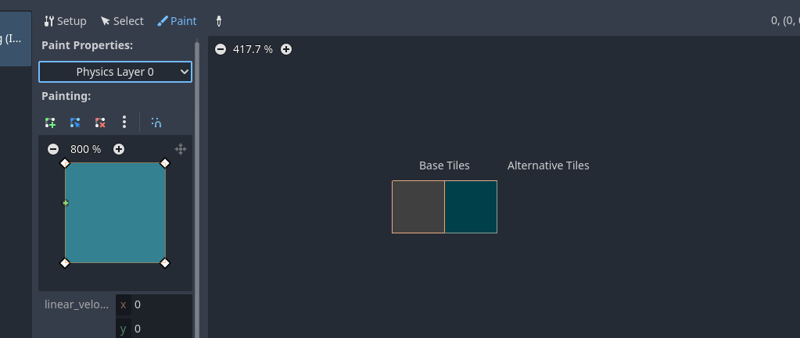
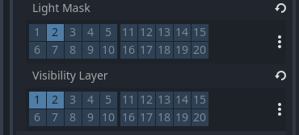

# Simple pathfinding template 2D in godot.



## Big thanks to `DevWorm` for [this video](https://www.youtube.com/watch?v=Lt9YdQ6Ztm4&ab_channel=DevWorm)

---

# Steps (Does not include UI and project settings):
1. `Player` :  
    - Create `CharacterBody2D` with `Collision` and a `Sprite`
    - Add basic movement script to it:
    
    ```
    extends CharacterBody2D

    const speed = 100
    var direction : Vector2

    func _physics_process(delta):
        velocity = direction * speed
        move_and_slide()

    func _unhandled_input(_event:InputEvent):
        direction.x = Input.get_axis("ui_left","ui_right")
        direction.y = Input.get_axis("ui_up","ui_down")
        direction = direction.normalized()
    ```
    

2. `Tilemap` - 
    - Create a tilemap as you wish, I've used the black for the walls, gray for floor.
    - Add `physics layer` to the black wall.
    - Add `navigation layer` to the gray tiles.
    - Build the map you want.
    
    
    


3. `Enemy` - 
    - Create `CharacterBody2D` with `Collision` and a `Sprite` (change color or something)
    - Add `NavigationAgent2D` and a `Timer`
        - `NavigationAgent2D`:  
            - You can set `Debug.Enabled` in the navigation to see the path
        - `Timer`:
            - Set `autostart` to `true`
            - The amount of time you will put in the timer, will determain the amount of time it will try to create a new path.
    - Add a script:
        ```
        extends CharacterBody2D

        const speed = 50

        @export var player: CharacterBody2D
        @onready var navigation_agent = $NavigationAgent2D as NavigationAgent2D

        func _ready():
            $Timer.timeout.connect(on_timer_timeout)

        func _physics_process(_delta:float) -> void:
            # Making the enemy go by navigator destination
            var direction = to_local(navigation_agent.get_next_path_position()).normalized()
            velocity = direction * speed
            move_and_slide()

        func set_direction() -> void:
            # Setting the navigators where is the player
            navigation_agent.target_position = player.global_position
            
            
        func on_timer_timeout():
            # On timeout, will create a new path.
            set_direction()
        ```
    **NOTE**:
    - Both `Player` and `Enemy` should share these layers for this "demo":  
    
